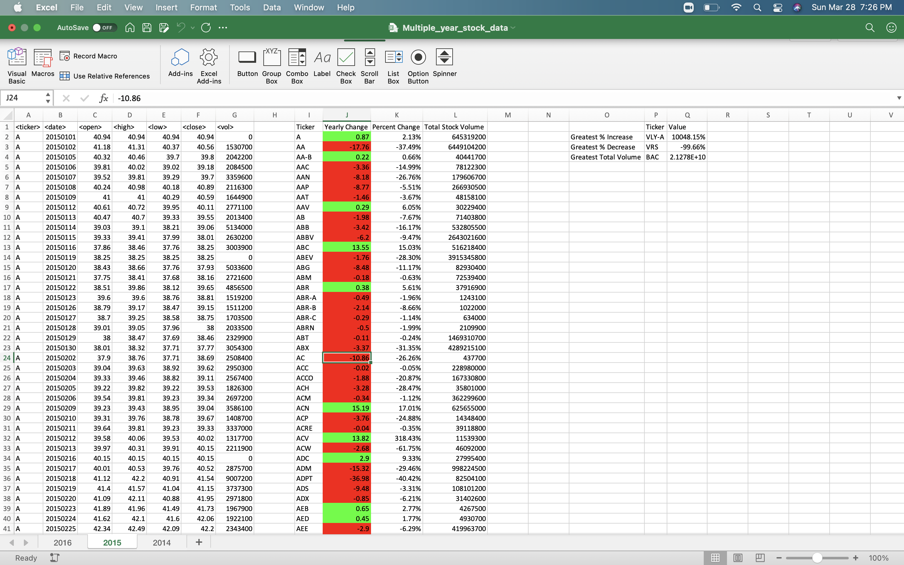
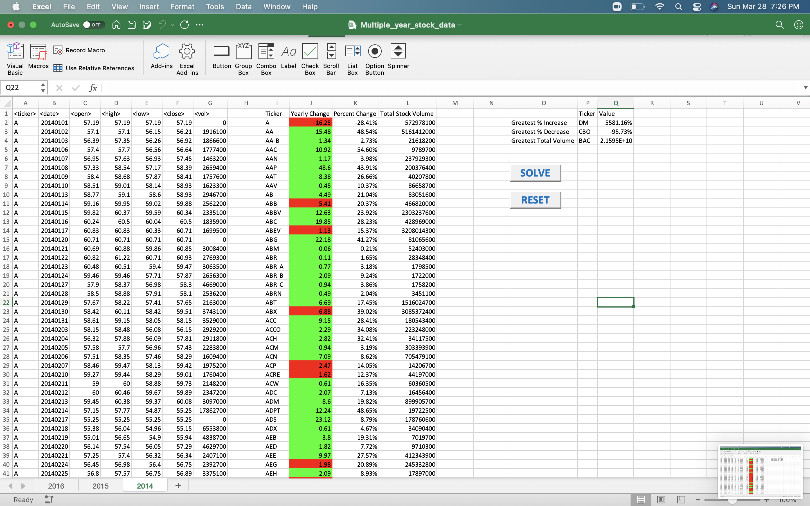

# VBA-challenge
## Homework and Bonus completed

I am submitting two VBA scripts, three screen shots of the solutions from the multi year stock data excel file and one excel file.  

* The code took me aproximately 3-4 minutes to run on my  Multiple_year_stock_data.xlsm file. And less than one minute to run on my alphabetical_test.xlsm file.

## VBA Scripts

* [My VBA Script](VBA_scripts/HWSolution.bas) - This is my code for solving the homework and bonus part.
* [Reset Script](VBA_scripts/Resetscript.bas) - This code was for reseting the excel sheets and erasing the solutions in case it was needed.  

## Screen Shots 

*  3 screen shots. One for each year, with my results on the Multi Year Stock Data.

## Extra Files

* [Alphabet Data Solved](excel_files/alphabetical_test.xlsm) 
* [Stock Data Solved] - Unable to upload. File exceeds maximum repository size.

- - - 
## Analysis
Three conclusions about Kickstarter campaigns.
* The theater category has been the one with the most amount of successful campaigns out of all the categories. For the subcategories, the subcategory that has been the most successful is the play subcategory.
* By looking at the graph from this sheet, we can conclude that the best month to start a project would be the month of May since there is a trend that this month tends to have the most amount of successful projects. Also, the month that is least likely to have successful projects is December. 
* The top two most successful categories in the U.S have been the theater and music categories. They also have been the ones with the most projects launched. 
Limitations of the dataset
The dataset has a limited sample size which is probably not the whole population of kickstarted. Also, the dataset doesn't show the creator, producer, and director of each project. There is a chance that if the director or producer is well known, the chance of success might vary.  Another limitation is that the data set doesn't show the type of rewards the project is offering; there might be a correlation between the number of backers a project has and the variety of rewards they'd offered. 
